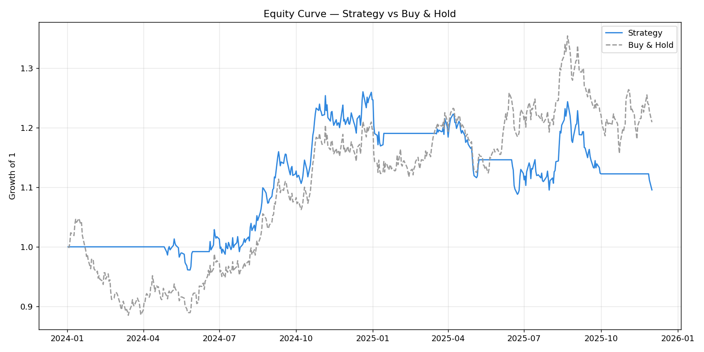
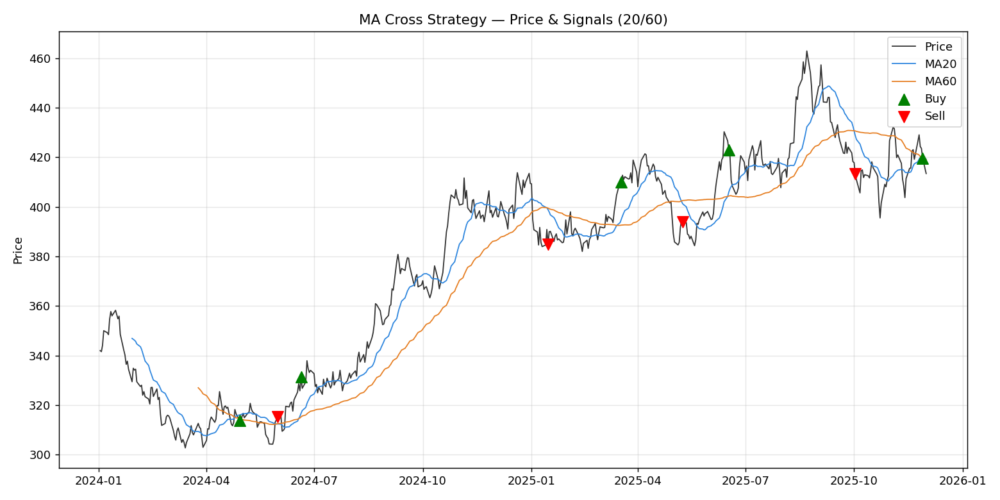

# 이동평균 크로스(MA Cross) 백테스트

단순 이동평균 교차 전략을 과거 시세로 검증하는 백테스트 프로젝트입니다.
단기 이동평균이 장기 이동평균을 상향 돌파하면(골든크로스) 매수, 하향 돌파하면(데드크로스) 청산하는
규칙 기반 전략을 구현하고, 누적 수익률·MDD·샤프지수·승률로 성과를 평가합니다.

> NH선물 REST API Pioneer 지원용으로 제작. 본 활동의 선물·옵션 전략 파트로 그대로 확장 가능한 구조입니다.

## 결과 요약

기본 파라미터(단기 20일 / 장기 60일), 500 영업일 기준:

| 지표 | 값 |
|------|-----|
| 누적 수익률 | +9.55% |
| 최대 낙폭(MDD) | -13.65% |
| 샤프지수 | 0.41 |
| 승률 | 51.38% |
| 매매 횟수 | 9 |

**자산곡선 (전략 vs 단순보유)**



**가격·이동평균·매매시점**



전략은 하락 국면에서 포지션을 비워 낙폭을 줄이지만, 횡보장에서는 잦은 교차로
수익을 반납하는 전형적인 MA 크로스의 한계도 함께 드러납니다.

## 실행 방법

```bash
pip install -r requirements.txt
python main.py
```

파라미터를 바꿔 비교할 수 있습니다:

```bash
python main.py --short 10 --long 40
```

실행하면 성과지표가 출력되고 `results/` 폴더에 그래프 2장이 저장됩니다.

## 구조

```
ma-cross-backtest/
├── main.py              # 실행 진입점 (백테스트 + 그래프)
├── strategy.py          # 이동평균 크로스 시그널 로직
├── backtest.py          # 수익률·성과지표 계산 엔진
├── data/
│   └── sample_prices.csv  # 샘플 시세 (바로 실행 가능)
├── results/             # 생성되는 그래프
├── requirements.txt
└── .gitignore
```

## 설계 노트

- **미래참조 방지**: 오늘 시그널로 다음 날 진입하도록 포지션을 한 칸 shift.
- **거래비용 반영**: 포지션이 바뀌는 날마다 수수료를 차감.
- **데이터 교체 용이**: `data/sample_prices.csv`를 실제 시세(예: NH선물 REST API로 받은 데이터)로
  바꾸기만 하면 그대로 동작. `date`, `close` 두 컬럼만 맞추면 됨.

## 다음 단계 (활동 중 확장 아이디어)

- NH선물 REST API 연동으로 실데이터 백테스트
- 손절/익절 등 위험관리 규칙 추가
- 파라미터 최적화 및 과최적화 검증(워크포워드)
- 여러 종목·복수상품 스프레드로 확장
